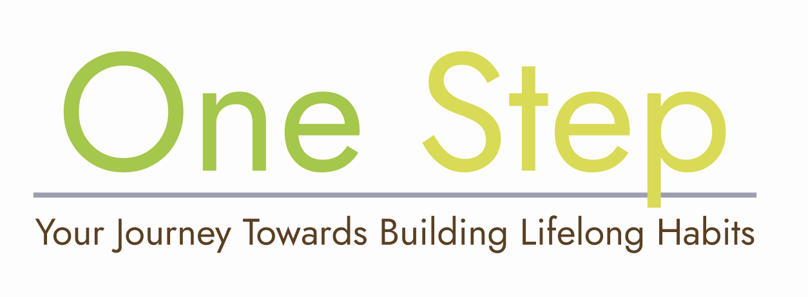

# OneStep

## Idea

Habits are very neccessary building blocks of long term self improvement as making small changes to you day to day life can lead to compounded results in the long run. We made OneStep, a platform that allows user to embark on the journey of self improvement by building habits.

Main emphasis of this app is on building and tracking daily goals, rather than long term goals. Here are the three main feautres that we implemented:

1. Daily Journal
2. Habit Tracker
3. Todo Daily Planner

> **Note:** There a lot of incomplete features on the time of submission for JourneyHack but it implement the core features with user authentication.

## Developement

This full stack application was made using React, Express and PostgreSQL. Make sure to have those installed properly on you local machine.

For installing and running the project, read development docs here: [dev.md](./docs/dev.md)